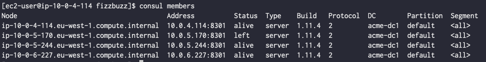

### Consul Development - Test Deployment

Project Requirements : 

- 3 x Server Cluster minimum at all times 

> 	*Autoscaling Group created that demands a minimum of 3 servers in the cluster at all times*

- Must be spread across mutiple AZ's


> 	Split accross 3 AZ's in eu-west-1 

- Consul must automatically restart on server reboots and rejoin the cluster.


> 	UserData script implements the Consul configuration file on start of a new consul instance.

    ```yaml
    retry_join = ["provider=aws tag_key=Name tag_value=AcmeOps-ConsulServer"]
    ```

- Each Server in the cluster should be disposable with no data lost during cluster failure or server lost

> 	Tested Blowing away a server to see if the autoscaling group would bring a new server back online into the cluster

	Server Removed from the cluster / New Server brought into the cluster to fill the void automatically.





- Use the latest version of Consul (1.9x)

> 	User Data pulls down the latest version of Consul as part of VM build.

- Write a bash script that stores in consul the numbers from 1 to 100. But for multiples of three stores “Fizz” instead of the number and for the multiples of five stores “Buzz”. For numbers which are multiples of both three and five stores “FizzBuzz” - Write a python3 program that implements the above algorithm.

> 	Using the consul_cv.sh script it will loop though the numbers 1 - 100 and as part of the function it will then pull in the python algorithm for determining what the current should be inputted into the key value store 

    ```shell
       current_number=$(python fizzbuzz_module.py $n)
       echo "consul kv put acme/operator/number $current_number"
    ```


Deployment Type : 

- Deployed using CircleCI Pipeline 


**Future iterations:** 

- Enable TLS Connection between the Consul Servers 
- Tighten up permissions
- Expand on the pipeline further to add additional features to the consul deployment.
- Build Nested stacks for cloudformation 
- Implement Slack notifications for pipeline runs 


Useful Resources :  

[https://aws.amazon.com/quickstart/architecture/consul/](https://aws.amazon.com/quickstart/architecture/consul/)

[https://github.com/jcolemorrison/getting-into-consul](https://github.com/jcolemorrison/getting-into-consul)

[https://dwmkerr.com/creating-a-resilient-consul-cluster-for-docker-microservice-discovery-with-terraform-and-aws/](https://dwmkerr.com/creating-a-resilient-consul-cluster-for-docker-microservice-discovery-with-terraform-and-aws/)

[https://www.youtube.com/watch?v=mxeMdl0KvBI](https://www.youtube.com/watch?v=mxeMdl0KvBI)

[https://learn.hashicorp.com/tutorials/consul/get-started?in=consul/getting-started](https://learn.hashicorp.com/tutorials/consul/get-started?in=consul/getting-started)

[https://learn.hashicorp.com/tutorials/consul/get-started-key-value-store](https://learn.hashicorp.com/tutorials/consul/get-started-key-value-store)
